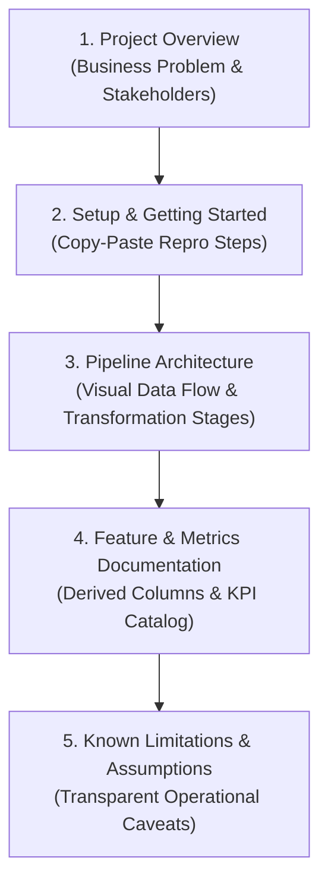
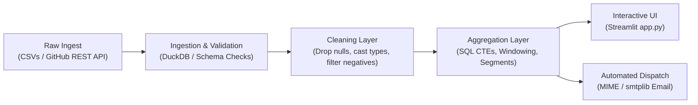

# Data Product Documentation & Delivery Guide (Module 2.54)

## Executive Overview

A data product without documentation is an unmaintainable black box. When the founding developer or data engineer leaves a team, undocumented projects suffer from "knowledge decay": new contributors struggle with environment setup, business stakeholders misunderstand derived metrics, and undocumented assumptions lead to silent analytical errors.

**Module 2.54** establishes the definitive framework for creating **production-grade data product documentation** that makes projects self-explanatory, auditable, and delivery-ready.

---

## 1. The 5-Section Data Product Documentation Framework

Every maintainable data product repository must feature a standardized `README.md` organized into five foundational sections:

### Deep Dive into the 5 Sections

| Section | Target Audience | Key Questions Answered | Deliverables |
| :--- | :--- | :--- | :--- |
| **1. Overview** | Executives, PMs, Engineers | *What problem does this product solve? Who are the users?* | Single concise paragraph framing the business stakes and core platform capabilities. |
| **2. Setup** | Developers, DevOps, CI/CD | *How do I run this locally from scratch in under 10 minutes?* | Cross-platform commands for Git clone, virtualenv creation, requirements, `.env` config, and launch. |
| **3. Pipeline** | Data Engineers, Architects | *How does data move from raw input to final dashboard/reports?* | Text and Mermaid data flow diagrams specifying input format, cleaning, aggregations, and destinations. |
| **4. Features** | Analysts, Business Stakeholders | *What does each column mean? What formula produced this KPI?* | Schema dictionaries for derived features and single-source-of-truth KPI definitions. |
| **5. Limitations** | Auditors, Reviewers, Leadership | *What does the product NOT do? What assumptions were made?* | Explicit statement of staleness windows, refund omissions, and boundary conditions. |

---

## 2. Pipeline Architecture Documentation & Data Flow

A text-based or Mermaid flow diagram allows new team members to understand system topology in 30 seconds:

### Transformation Stages
1. **Ingestion Layer**: Ingests transactional CSVs and external REST APIs with primary key and null validation.
2. **Cleaning Layer**: Standardizes ISO-8601 timestamps, sanitizes negative values, and enforces categorical tier labels.
3. **Aggregation Layer**: Executes analytical SQL CTEs, computes distribution skewness, calculates drop-offs, and flags anomalies.
4. **Presentation Layer**: Exposes findings via interactive Streamlit views (`st.columns`, `st.expander`, `st.session_state`) and automated executive email briefings.

---

## 3. Derived Features & Key Performance Indicators (KPIs)

Documenting feature definitions eliminates the endless "what does this number mean?" questions:

### Derived Features Dictionary

| Column Name | Data Type | Calculation / Logic | Business Meaning | Example |
| :--- | :--- | :--- | :--- | :--- |
| `revenue_30d` | `Float` | `SUM(order_amount)` over trailing 30 days | Short-term customer monetization momentum | `4523.50` |
| `days_since_order` | `Integer` | `CURRENT_DATE - last_order_date` | Purchase recency & inactivity indicator | `12` |
| `churn_risk` | `String` | Categorical grade based on response SLA & ticket volume | High / Medium / Low customer flight probability | `"High"` |
| `segment_rank` | `Integer` | `DENSE_RANK() OVER (PARTITION BY segment ORDER BY spend DESC)` | Relative account standing within peer group | `3` |
| `response_bucket` | `Categorical` | First support reply latency cohort (`<2h`, `2-4h`, `4-24h`, `>24h`) | SLA tier driving 4x retention difference | `"< 2 hours"` |

---

## 4. Transparent Known Limitations & Assumptions

Documenting what a product does *not* do demonstrates professional maturity and protects against misinterpretation:

1. **Point-in-Time Data Staleness**: Pipeline executes on scheduled intervals; maximum historical data staleness is 24 hours.
2. **Gross vs Net Accounting**: Top-line ARR reflects gross recognized billing; partial refunds and chargebacks are not currently subtracted.
3. **Latest Segment Attribution**: Segment classification reflects an account's most recent contract status; mid-year upgrades attribute historical spend to the newer tier.
4. **Static Outlier Bounds**: Anomaly detection utilizes IQR thresholds rather than real-time machine-learning seasonal baselines.
5. **SMTP Credential Requirement**: Automated email dispatch requires environment variables; in local development, it defaults gracefully to a simulated sandbox without crashing.

---

## 5. Architectural Checklist & Validation Summary

| Requirement | Implementation | Verification Status |
| :--- | :--- | :--- |
| **5-Section Structure** | Overview, Setup, Pipeline, Features, Limitations in `README.md` | Verified ✔ |
| **Pipeline Diagram** | Clear text flow + Mermaid diagram mapping transformations | Verified ✔ |
| **Feature Catalog** | Schema table with name, type, description, and concrete examples | Verified ✔ |
| **Limitations Section** | Explicit disclosure of staleness, refund rules, and thresholds | Verified ✔ |
| **Zero-Help Setup** | Copy-paste macOS, Linux, and Windows onboarding commands | Verified ✔ |
| **Automated Testing** | `documentation_delivery_runner.py` validates all criteria | Verified ✔ |
