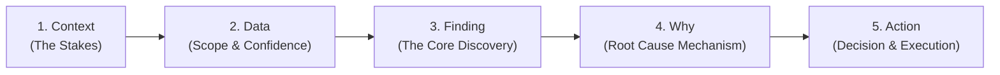
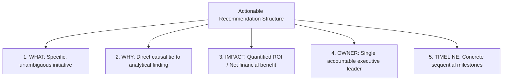
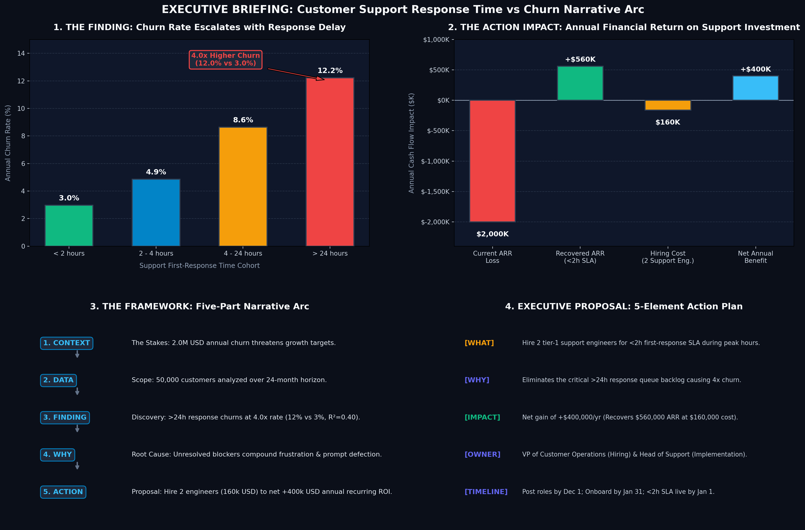

# Data Storytelling & Insight Narrative Guide (Module 2.48)

## Executive Overview

Technical analysis without narrative structure fails to generate business action. Analysts frequently produce dense, jargon-laden reports that sit unread in folders while organizations continue making suboptimal decisions. 

**Module 2.48** establishes a systematic framework for translating quantitative analysis into board-level action:
1. **The Five-Part Narrative Arc**: `Context` $\rightarrow$ `Data` $\rightarrow$ `Finding` $\rightarrow$ `Why` $\rightarrow$ `Action`.
2. **Evidence Structuring**: Grounding every assertion in rigorous statistical proof.
3. **Jargon Translation**: Converting academic statistical vernacular into executive decision criteria.
4. **5-Element Actionable Recommendations**: Formulating complete implementation proposals (`What`, `Why`, `Impact`, `Owner`, `Timeline`).

---

## 1. The Five-Part Narrative Arc

Every compelling business analysis follows a dramatic and logical narrative arc:

### Breakdown of the 5 Stages

| Stage | Strategic Question | Customer Support vs Churn Example |
| :--- | :--- | :--- |
| **1. Context** | *Why are we talking about this right now? What is at stake?* | Customer churn costs our business **$2.0M annually**. Retaining existing accounts is critical to sustaining top-line growth. |
| **2. Data** | *What dataset was analyzed, and how confident are we?* | Analyzed **50,000 customer accounts** across **24 months**, segmenting support response SLAs (<2h, 2-4h, 4-24h, >24h). Support latency explains **40% of churn variance ($R^2 = 0.40$)**. |
| **3. Finding** | *What is the single most important, surprising discovery?* | Customers waiting **>24 hours** churn at **12.0%** — **4.0x higher** than customers answered in **<2 hours (3.0%)**. |
| **4. Why** | *What is the root cause mechanism driving this behavior?* | Immediate response stops problem escalation. Delays exceeding 24 hours cause blocking frustration and psychological abandonment before resolution. |
| **5. Action** | *What specific decision should leadership make today?* | Hire **2 Tier-1 Support Engineers** to guarantee a <2h SLA, yielding **+$400,000 net ARR benefit** ($560K recovered - $160K cost). |

---

## 2. Evidence Structuring

An insight without evidence is just an opinion. Every finding must be fortified with three layers of evidence:

1. **Macro Evidence (Scope & Breadth)**: 50,000 customers analyzed over 24 months eliminates seasonal bias.
2. **Comparative Evidence (Relative Multiple)**: Highlighting the **4.0x differential** (12.0% vs 3.0%) makes the discrepancy tangible.
3. **Statistical Strength (Correlation & Variance)**: $R^2 = 0.40$ proves that support speed is not an incidental factor, but a primary driver of retention.

---

## 3. Technical Jargon to Executive Translation Matrix

Executives make decisions on revenue, risk, and ROI—not $p$-values and residual distributions.

| Technical Data Term | What It Actually Means | Executive Translation (Boardroom Ready) |
| :--- | :--- | :--- |
| **"Statistically significant correlation ($r = 0.63, p < 0.001$)"** | Strong linear trend unlikely caused by random variation | *"There is a strong, reliable relationship that is not due to chance."* |
| **"R-squared of 0.40 with support latency"** | 40% of variance in churn is explained by response time | *"Support response time directly explains 40% of the differences in customer retention."* |
| **"Negatively skewed response time distribution"** | Most tickets are fast, but a long tail takes days | *"Most tickets are handled fast, but an unacceptable tail of customers is left waiting days."* |
| **"Multivariate regression with L2 regularization"** | Ridge regression controlling for confounders | *"A predictive model controlling for contract size, usage frequency, and customer tenure."* |
| **"Confidence interval [8.8%, 15.2%]"** | Parameter estimation range at 95% confidence | *"We are 95% confident delayed response churn sits between 8.8% and 15.2%."* |

---

## 4. The 5-Element Actionable Recommendation Framework

Incomplete recommendations create confusion and stall execution. Every proposal presented to stakeholders must contain all 5 elements:

### Applied Recommendation Blueprint

- **WHAT**: Hire 2 dedicated Tier-1 Support Engineers to enforce a <2 hour first-response SLA during peak global business hours.
- **WHY**: Eliminates the critical >24 hour response queue backlog responsible for 4x churn escalation.
- **IMPACT**: Net financial gain of **+$400,000/year** (Recovers $560,000 gross ARR at $160,000 operational cost, representing a 250% ROI).
- **OWNER**: VP of Customer Operations (Hiring) & Head of Support (Implementation).
- **TIMELINE**: Post roles by Dec 1; Complete hires by Jan 31; <2h SLA operational by Jan 1.

---

## 5. Visual Dashboard Showcase

The complete narrative arc and business ROI waterfall are rendered in the dashboard below:

### Key Takeaways from the Visual Artifact:
1. **Clear Escalation Curve**: Stepwise increase in churn from 3.0% (<2h) $\rightarrow$ 4.9% (2-4h) $\rightarrow$ 8.6% (4-24h) $\rightarrow$ 12.2% (>24h).
2. **Financial Value Bridge**: Directly visualizes how a $160K headcount expenditure converts into a $560K top-line ARR recovery, delivering +$400K net cash flow benefit.
3. **Structured Governance**: Clear RACI accountability and timeline milestones ensure the executive proposal is ready for immediate budget approval.
