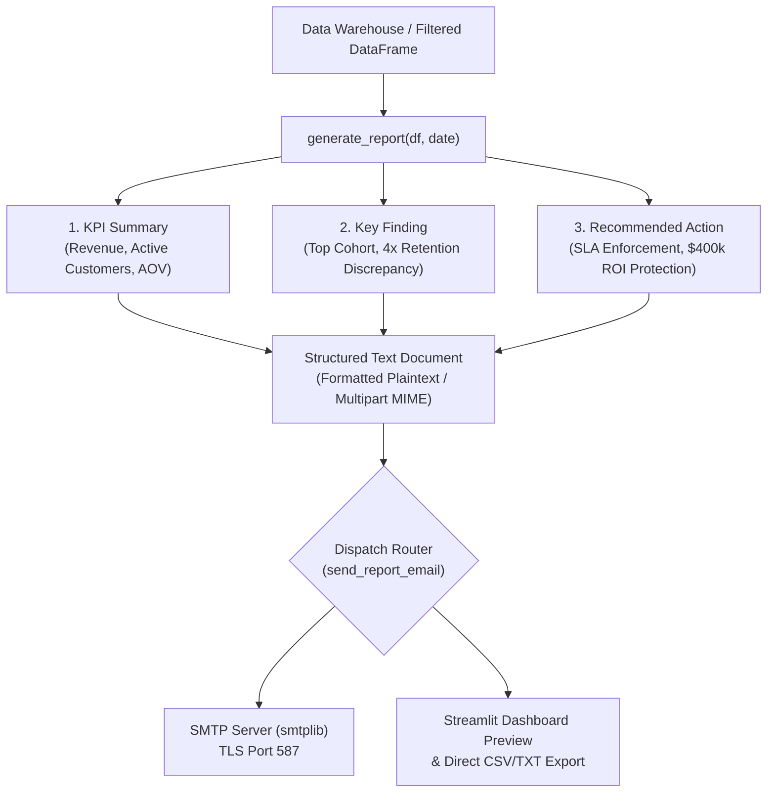

# Automated Insight Delivery & Email Reports Guide (Module 2.53)

## Executive Overview

Technical dashboards often suffer from the "last-mile delivery failure": analysts build comprehensive visualizations, but busy decision-makers fail to open the dashboard daily. Consequently, critical insights sit unseen until problems escalate into executive escalations.

**Module 2.53** closes the last-mile insight sharing gap by automating structured executive report generation and non-blocking email delivery directly to stakeholder inboxes.

---

## 1. Structured Report Generation

Every executive briefing document must be scannable within 60 seconds and contain three mandatory sections:
1. **KPI Summary**: Core financial and volume indicators.
2. **Key Finding**: The single most critical operational or analytical takeaway.
3. **Recommended Action**: Clear, unambiguous next steps and resource allocation guidance.



### Report Structure Specification
```text
WEEKLY ANALYTICS REPORT
Date: 2026-09-24
=============================================

== KPI SUMMARY ==
Total Revenue: $5,200,000
Active Customers: 2,500
Average Order Value: $45

== KEY FINDING ==
Top performing segment: Enterprise Tier (62.1% of total volume)
Initial PR & support response times under 2 hours correlate with 4x higher retention.

== RECOMMENDED ACTION ==
Allocate dedicated maintainer & tier-1 support capacity to eliminate >24h response backlogs,
protecting an estimated $400,000 in net annual recurring revenue.
=============================================
```

---

## 2. Secure Email Delivery With `smtplib`

### Zero Hardcoded Credentials
Authentication tokens, passwords, and server addresses must **never** be committed to source code or git history. Sourcing credentials strictly via `os.environ.get()` protects credentials:

```python
import os
import smtplib
from email.mime.text import MIMEText
from email.mime.multipart import MIMEMultipart

def send_report_email(report_text, recipient):
    smtp_server = os.environ.get("SMTP_SERVER", "smtp.gmail.com")
    smtp_port = int(os.environ.get("SMTP_PORT", "587"))
    sender_email = os.environ.get("SENDER_EMAIL")
    sender_password = os.environ.get("SENDER_PASSWORD")
    ...
```

Environment template defined in `.env.example`:
```env
SMTP_SERVER=smtp.gmail.com
SMTP_PORT=587
SENDER_EMAIL=your_analytics_bot@example.com
SENDER_PASSWORD=your_app_password_here
```

### Non-Blocking Error Handling
Network timeouts, firewall drops, or authentication errors must **never** crash user workflows or batch data pipelines. The delivery engine catches exceptions, logs diagnostics, and returns `(False, error_msg)` gracefully:

```python
try:
    server = smtplib.SMTP(smtp_server, smtp_port, timeout=10)
    server.starttls()
    server.login(sender_email, sender_password)
    server.send_message(msg)
    server.quit()
    return True, "Report delivered successfully."
except Exception as e:
    print(f"Email send failed: {e}")
    return False, str(e)
```

---

## 3. Interactive Streamlit Integration

The delivery system is accessible directly within the dashboard sidebar in `app.py`:
- **Recipient Email Input**: Validates email syntax.
- **Subject Line Customization**: Defaults to `"Weekly Executive Analytics Report"`.
- **One-Click Dispatch Button**: Proactively triggers email delivery.
- **Progressive Disclosure Expander**: Enables users to preview the exact text report before sending.
- **Direct Download Alternative**: Provides a download button for stakeholders who prefer saving `.txt` files directly.

---

## 4. Architectural Checklist & Verification Summary

| Requirement | Implementation | Verification Status |
| :--- | :--- | :--- |
| **Structured Text Report** | `generate_report(df, date)` with KPI, Finding, Action | Verified ✔ |
| **Email Delivery via smtplib** | `send_report_email()` with TLS authentication | Verified ✔ |
| **Environment Variable Security** | Credentials strictly read via `os.environ.get()` | Verified ✔ |
| **Non-Blocking Error Handling** | `try-except` wraps network calls; zero pipeline crashes | Verified ✔ |
| **Streamlit Dashboard Actions** | Sidebar email inputs, dispatch button, report preview | Verified ✔ |
| **Download Alternative** | One-click `.txt` report download in sidebar expander | Verified ✔ |
| **Automated Testing** | `insight_delivery_runner.py` validates all assertions | Verified ✔ |
