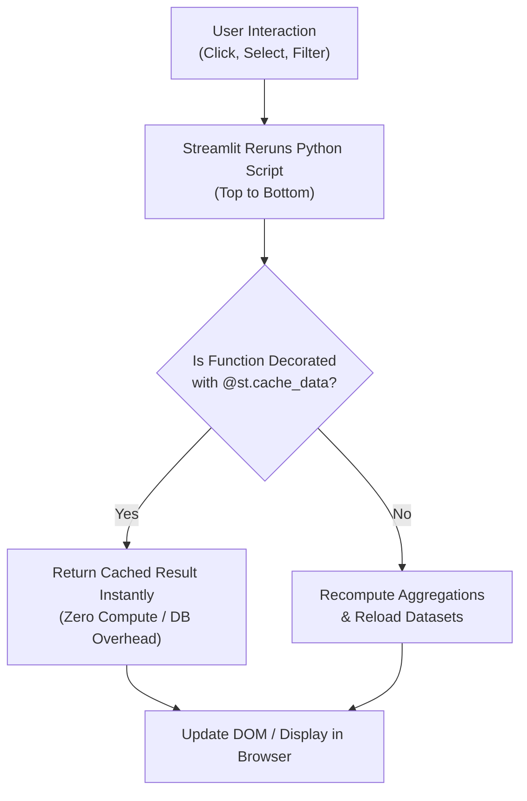
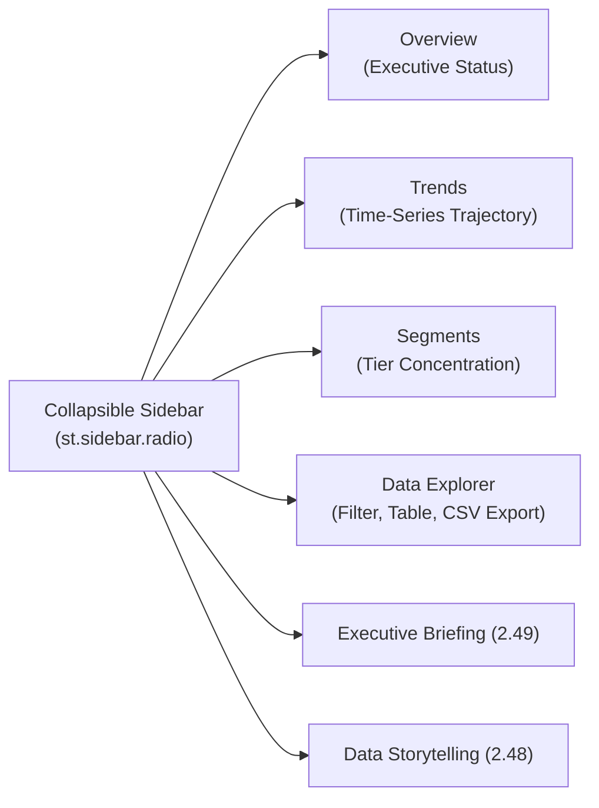

# Streamlit App Structure & Navigation Architecture Guide (Module 2.51)

## Executive Overview

Technical analytics scripts without clear product structure fail in business adoption. When an analytics team stacks 15 charts, 8 filters, and multiple tables into a single endless scrolling page, stakeholders experience cognitive overload, fail to discover critical insights, and abandon the application.

**Module 2.51** establishes the standard architecture for transforming Python analytics scripts into a structured, highly responsive, and navigable web application using **Streamlit**.

---

## 1. Streamlit Execution Model & Caching

### Full Script Rerun on Interaction
Unlike traditional decoupled client-server web apps, Streamlit executes the entire Python script sequentially from line 1 to the end every time a user triggers an interaction (clicking a button, moving a slider, switching a radio button).



### Why Caching (`@st.cache_data`) Matters
Because of the rerun model, un-cached database queries or heavy calculations will repeat on every single user click, resulting in severe lag. Using `@st.cache_data` caches function returns based on input parameters:

```python
import streamlit as st
import pandas as pd

@st.cache_data
def load_monthly_trends_data():
    # Only runs once; subsequent reruns return cached memory dataframe
    return pd.read_csv("data/monthly_trends.csv")
```

---

## 2. Sidebar Navigation & Multi-Section Architecture

The sidebar serves as the control hub for navigation and global filters. The main viewport responds dynamically to sidebar selections.



### Routing Pattern (`app.py`)
```python
import streamlit as st

st.sidebar.title("Navigation")
page = st.sidebar.radio(
    "Go to",
    ["Overview", "Trends", "Segments", "Data Explorer", "Executive Briefing (2.49)", "Data Storytelling (2.48)"]
)

if page == "Overview":
    render_overview_view()
elif page == "Trends":
    render_trends_view()
elif page == "Segments":
    render_segments_view()
elif page == "Data Explorer":
    render_data_explorer_view()
```

---

## 3. Layout Components: Columns & Progressive Disclosure

### `st.columns`: Horizontal Status Scanning
Horizontal layout maps to how humans naturally read dashboards. KPI metrics should always be placed side-by-side using `st.columns`:

```python
col1, col2, col3, col4, col5 = st.columns(5)
with col1:
    st.metric("Revenue", "$5.2M", "+12.5%")
with col2:
    st.metric("Users", "2,500", "+5.2%")
with col3:
    st.metric("AOV", "$45", "+2.1%")
with col4:
    st.metric("Churn", "5.2%", "-2.8%", delta_color="inverse")
with col5:
    st.metric("NPS", "72", "+4")
```

### `st.expander`: Progressive Disclosure
Do not clutter the primary viewport with raw data tables or methodology notes that 90% of users don't need on their first view. Use expandable drawers:

```python
with st.expander("Methodology & Calculation Notes"):
    st.write("Revenue reflects GAAP ARR booked at month-end close...")

with st.expander("View Underlying Trend Data"):
    st.dataframe(df_trends)
    st.download_button("Download CSV", df_trends.to_csv(), "trends.csv")
```

---

## 4. Visual Hierarchy Standards

To make pages instantly scannable, follow strict header hierarchy rules:

1. **`st.title`**: Used exactly **once** per view for the primary page title.
2. **`st.header`**: Used for major thematic sections (e.g., "Key Performance Indicators", "Revenue & Churn Dynamics").
3. **`st.subheader`**: Used for individual chart titles or subsection widgets.
4. **`st.divider`**: Visually separates major sections with horizontal lines.

---

## 5. Architectural Checklist & Quality Assurance

| Requirement | Implementation in `app.py` | Verification Status |
| :--- | :--- | :--- |
| **Sidebar Navigation** | `st.sidebar.radio` with 6 dedicated views | Verified ✔ |
| **At Least 3 Content Views** | Overview, Trends, Segments, Data Explorer | Verified ✔ |
| **Horizontal Columns** | `st.columns(5)` for executive KPI scanning | Verified ✔ |
| **Progressive Disclosure** | `st.expander` for methodology and raw tables | Verified ✔ |
| **Visual Hierarchy** | Strict `st.title` $\rightarrow$ `st.header` $\rightarrow$ `st.subheader` $\rightarrow$ `st.divider()` | Verified ✔ |
| **Performance Caching** | `@st.cache_data` on all data loaders | Verified ✔ |
| **Clean Environment Run** | Fully tested via `streamlit_structure_runner.py` & `main.py` | Verified ✔ |
