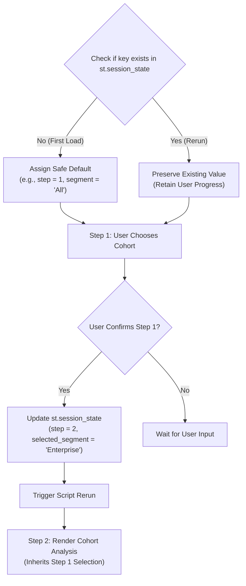

# Streamlit Session State & Workflow Management Guide (Module 2.52)

## Executive Overview

Streamlit executes Python scripts from top to bottom on every single user interaction. While this reactive execution model makes development straightforward, it presents a significant UX challenge for complex analytics: **without state persistence, multi-step user workflows lose their context on every interaction.**

**Module 2.52** details how to implement `st.session_state` to build persistent multi-step analytical workflows, synchronize UI widget states, and provide a clean reset mechanism that preserves analytical continuity.

---

## 1. Understanding Streamlit Session State

`st.session_state` is a dictionary-like object that persists across script reruns within a single browser session.



### Safe Default Initialisation Pattern
Always verify whether the key already exists before initialising. Without this check, every script rerun would overwrite the user's progress back to the starting default:

```python
import streamlit as st

# Safe default initialisation
if "selected_segment" not in st.session_state:
    st.session_state["selected_segment"] = "All"
if "workflow_step" not in st.session_state:
    st.session_state["workflow_step"] = 1
if "analysis_result" not in st.session_state:
    st.session_state["analysis_result"] = None
if "workflow_history" not in st.session_state:
    st.session_state["workflow_history"] = []
```

---

## 2. Multi-Step Workflows with State Dependency

When Step 2 depends on values configured in Step 1, session state acts as the connective memory between views.

### Applied Implementation Pattern
```python
# Step 1: User Selects Segment
st.subheader("Step 1: Select Target Customer Cohort")
segment_options = ["All", "Enterprise", "Mid-Market", "Startup"]

# Synchronize widget default with session state
current_index = segment_options.index(st.session_state["selected_segment"])

chosen_segment = st.selectbox(
    "Choose a segment to analyze",
    options=segment_options,
    index=current_index
)

if st.button("Confirm Segment & Advance to Step 2"):
    st.session_state["selected_segment"] = chosen_segment
    st.session_state["workflow_step"] = 2
    st.rerun()

# Step 2: Show Analysis (Only executes if Step 1 is confirmed)
if st.session_state["workflow_step"] >= 2:
    st.subheader("Step 2: Cohort Profitability & Churn Analysis")
    confirmed_seg = st.session_state["selected_segment"]
    
    # Filter dataset using persisted selection
    filtered_df = df if confirmed_seg == "All" else df[df["Segment"] == confirmed_seg]
    
    st.metric("Total Cohort Spend", f"${filtered_df['Annual Spend ($)'].sum():,.2f}")
    st.dataframe(filtered_df)
```

---

## 3. Widget Synchronization vs Default Values

| Widget Defaults | Session State |
| :--- | :--- |
| Evaluated on every rerun | Persists across all reruns in the active session |
| Resets when independent controls trigger execution | Survives global filter changes, date adjustments, and page switches |
| **Best For**: Initial form presentation | **Best For**: Multi-step workflows, filter memory, confirmed selections |

**The Golden Sync Rule:** Read `st.session_state` to set the widget's default `index`, and write back to `st.session_state` when the user confirms their selection.

---

## 4. Clean Reset Mechanism

Rather than wiping the entire browser session (which might discard uploaded files or unrelated preferences), target only the specific workflow keys and trigger `st.rerun()`:

```python
if st.sidebar.button("🔄 Reset Workflow State"):
    keys_to_reset = ["selected_segment", "workflow_step", "analysis_result", "workflow_history"]
    for key in keys_to_reset:
        if key in st.session_state:
            del st.session_state[key]
    st.sidebar.success("Workflow reset!")
    st.rerun()
```

---

## 5. Architectural Checklist & Verification Summary

| Requirement | Implementation in `app.py` | Verification Status |
| :--- | :--- | :--- |
| **Persisted Values** | $\ge 3$ distinct keys (`selected_segment`, `workflow_step`, `analysis_result`, `workflow_history`) | Verified ✔ |
| **Safe Initialization** | `if key not in st.session_state:` checks on all persistent keys | Verified ✔ |
| **Multi-Step Dependency** | Step 2 conditionally renders based on `workflow_step >= 2` | Verified ✔ |
| **Analytical Continuity** | State survives sidebar global filter changes (Fiscal Year, Units) | Verified ✔ |
| **Clean Reset Mechanism** | Dedicated reset button deletes workflow keys and calls `st.rerun()` | Verified ✔ |
| **Inline Documentation** | Explanatory comments documenting state persistence rationale | Verified ✔ |
| **Automated Testing** | `session_state_runner.py` executes 5 automated tests across all patterns | Verified ✔ |
