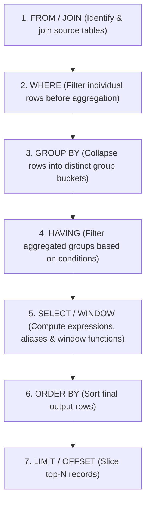

# Engineering Pattern Guide: SQL Filtering, Grouping & Aggregation
## WHERE vs. HAVING Architecture & Best Practices

---

### Executive Summary: The Core Question

> **Problem**: *"Show Enterprise customers with >$10k annual spending - do you filter before or after grouping? Do you use WHERE or HAVING?"*

#### The Correct Answer & Pattern:
1. **Filter `customer_type = 'Enterprise'` BEFORE grouping in the `WHERE` clause.**
   - Why: `customer_type` is an attribute of individual customer rows. Filtering it in `WHERE` discards non-enterprise records before the database allocates memory for hashing or grouping.
2. **Filter `SUM(amount) > 10000` AFTER grouping in the `HAVING` clause.**
   - Why: Annual spending is an **aggregate metric** (`SUM(amount)`) calculated across multiple rows. An aggregate does not exist until the groups are formed.

```sql
SELECT 
    c.customer_id,
    c.name as customer_name,
    c.customer_type,
    SUM(t.amount) as annual_spending
FROM transactions t
JOIN customers c ON t.customer_id = c.customer_id
WHERE c.customer_type = 'Enterprise'               -- WHERE: Filter rows BEFORE grouping
  AND t.transaction_date >= DATE '2024-01-01'       -- WHERE: Scope analysis timeframe
  AND t.transaction_status = 'completed'            -- WHERE: Exclude invalid/unsettled rows
  AND t.amount > 0                                  -- WHERE: Remove negative amounts/refunds
GROUP BY c.customer_id, c.name, c.customer_type
HAVING SUM(t.amount) > 10000                        -- HAVING: Filter groups AFTER aggregation
ORDER BY annual_spending DESC;
```

---

### SQL Logical Query Processing Order

To write efficient and bug-free queries, understanding the SQL execution pipeline is essential:



---

### The Fundamental Distinction: WHERE vs. HAVING

| Feature | `WHERE` Clause | `HAVING` Clause |
| :--- | :--- | :--- |
| **Operates On** | Individual rows | Aggregated groups / buckets |
| **Execution Timing** | **Before** `GROUP BY` | **After** `GROUP BY` |
| **Can Use Aggregates?** |  **No** (`WHERE SUM(amount) > 100` errors) |  **Yes** (`HAVING SUM(amount) > 100`) |
| **Can Use Indexes?** |  **Yes** (Uses B-Tree / hash indexes) |  **No** (Evaluates aggregated buckets) |
| **Primary Purpose** | Data quality, scoping, pruning row volume | Business rules on summaries, group thresholds |

---

### Query Patterns Implemented

#### 1. Data Quality Filtering in `WHERE` (`queries/where_filtering.sql`)
- **Rule**: Never aggregate dirty data.
- **Implementation**:
  - `transaction_date >= DATE '2024-01-01'`: Scopes the temporal analysis.
  - `amount > 0`: Excludes refunds and zero-value chargebacks.
  - `transaction_status = 'completed'`: Excludes failed or pending charges.

#### 2. Multi-Dimensional Aggregation (`queries/group_by_aggregation.sql`)
- **Rule**: Every column in `SELECT` must either be in the `GROUP BY` list or inside an aggregate function.
- **Implementation**: Groups by `customer_type` and `DATE_TRUNC('month', transaction_date)` to reveal monthly trends across segments.

#### 3. Group-Level Business Thresholds (`queries/having_filtering.sql`)
- **Rule**: Apply minimum sample size or aggregate thresholds after grouping.
- **Implementation**: Filters for `SUM(amount) > 10000` (high spenders) and `COUNT(*) >= 5` (repeat buyers).

#### 4. Real-World Combined Pattern (`queries/where_having_combined.sql`)
- **Rule**: Maximize row pruning in `WHERE`, then apply segment size constraints in `HAVING`.
- **Implementation**: Filters valid completed payments in `WHERE`, and enforces statistical segment viability (`COUNT(DISTINCT customer_id) >= 100` and `SUM(amount) > 100000`) in `HAVING`.

#### 5. Ranking & Surface Top Performers (`queries/order_by_ranking.sql`)
- **Rule**: Combine `RANK() OVER (ORDER BY SUM(amount) DESC)` with `LIMIT` to isolate top performers across industry categories.

#### 6. Percentage Share of Total (`queries/percentage_share.sql`)
- **Rule**: Use window functions (`SUM(segment_revenue) OVER ()`) over grouped CTEs to calculate relative percentages without secondary queries.

---

### Performance Optimization: Why Filtering in WHERE is Faster

```text
Without WHERE (Pushed to HAVING):
1,000,000 Raw Rows ──> [ GROUP BY Engine ] ──> 100,000 Groups ──> [ HAVING Filter ] ──> 500 Output Groups
                       (Expensive: 1M rows hashed in memory)

With WHERE (Optimized):
1,000,000 Raw Rows ──> [ WHERE Filter ] ──> 20,000 Rows ──> [ GROUP BY Engine ] ──> 500 Output Groups
                       (Fast: 98% rows eliminated early)
```

1. **Memory Footprint**: Minimizes hash table allocations during group formation.
2. **CPU & I/O Reduction**: Eliminates unnecessary disk spillover when grouping large datasets.
3. **Index Utilization**: `WHERE` conditions take full advantage of table indexes.
